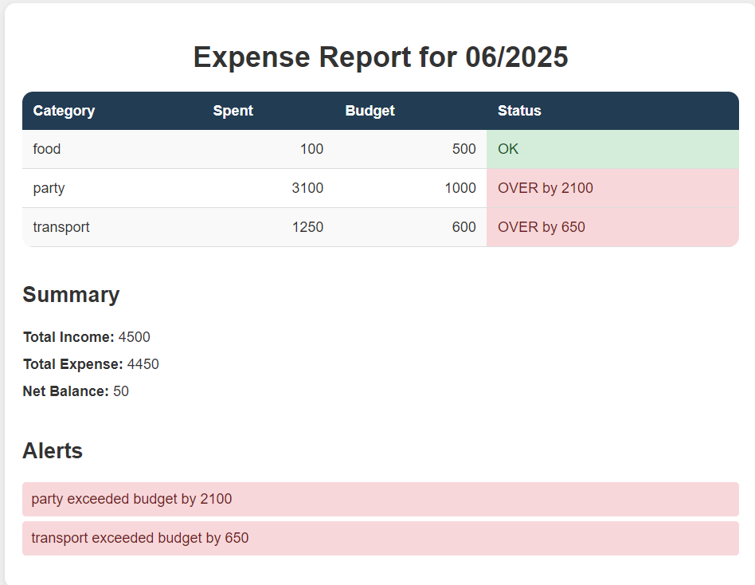

# Budget#  
**Budget#** é uma DSL para **gerenciamento de despesas pessoais** num único mês. Com ela você:

1. Define um mês de controle (`MM/YYYY`).  
2. Configura budgets e receitas dentro de um bloco `setup`.  
3. Declara variáveis para cálculos dinâmicos.  
4. Lança despesas pontuais ou recorrentes com sintaxe simples.  
5. Gera, ao fim, um relatório completo com alertas de estouro.

## Motivação  
Evitar digitar manualmente cada lançamento em planilhas. Centralizando toda a lógica de orçamento e gastos em um script legível, parametrizado e auditável, como se fosse um diário com seus gastos.

## Features

- **Mês único**  
  Todo script roda exclusivamente para o mês declarado:  
  ```plaintext
  for month 06/2025
  ```

- **Bloco `setup` obrigatório**  
  Agrupa definição de budgets e receitas antes de qualquer despesa:  
  ```plaintext
  setup {
    set budget transport to 600
    add income salary 3500
  }
  ```

- **Variáveis** (`var x = expr`)  
  Permitem cálculos dinâmicos dentro de `setup`:  
  ```plaintext
  setup {
    var dailyUber   = 20
    var daysInMonth = 30
    set budget transport to dailyUber * daysInMonth  # 20×30 = 600
  }
  ```

- **Despesas pontuais e recorrentes**  
  - *Pontual* (sem cláusula):  
    ```plaintext
    spend 100 on food
    ```  
  - *Recorrente* (todo dia, N dias):  
    ```plaintext
    spend 20 on transport every day for 30 days
    ```

- **Expressões aritméticas inteiras**  
  Suporte a `+`, `-`, `*`, `/` e uso de parênteses:
  ```plaintext
  setup {
    set budget food to (300 + 200) * 1
    add income bonus to 500 / 5 + 100
  }
  ```

- **Relatório automático**  
  Soma receitas, despesas e budgets, exibindo alertas:
  ```plaintext
  report month 06/2025
  ```

## EBNF

```ebnf
<program>        ::= <month-decl> <setup-block> { <statement-body> } <report-stmt> ;

<month-decl>     ::= "for" "month" <number> "/" <number> ;

<setup-block>    ::= "setup" "{" { <var-stmt> | <budget-stmt> | <income-stmt> } "}" ;

<statement-body> ::= <var-stmt>
                   | <expense-stmt> ;

<var-stmt>       ::= "var" <identifier> "=" <expr> ;

<budget-stmt>    ::= "set" "budget" <identifier> "to" <expr> ;

<income-stmt>    ::= "add" "income" <identifier> <expr> ;

<expense-stmt>   ::= "spend" <expr> "on" <identifier> [ <recur-clause> ] ;

<recur-clause>   ::= "every" "day" "for" <expr> "days" ;

<report-stmt>    ::= "report" "month" <number> "/" <number> ;

/* EXPRESSÕES ARITMÉTICAS */
<expr>           ::= <term> { ("+" | "-") <term> } ;
<term>           ::= <factor> { ("*" | "/") <factor> } ;
<factor>         ::= <number> | <identifier> | "(" <expr> ")" ;

/* IDENTIFICADORES */
<identifier>     ::= <letter> { <letter> | <digit> | "_" } ;

/* LITERAIS NUMÉRICOS */
<number>         ::= <digit> { <digit> } ;

/* CARACTERES - Apenas para definição, não aparecem em regras de produção */
<digit>          ::= "0" … "9" ;
<letter>         ::= "A" … "Z" | "a" … "z" ;
<any-char>       ::= <letter> | <digit> | <symbol> | <whitespace> ;
<symbol>         ::= "(" | ")" | "{" | "}" | "-" | "+" | "*" | "/" | "=" | "\"" ;
<whitespace>     ::= " " | "\t" ;
<NL>             ::= "\n" ;
```

## Exemplo de Script
```
# Mês de controle: junho de 2025
for month 06/2025

setup {
  var dailyUber   = 20
  var daysInMonth = 30
  set budget transport to dailyUber * daysInMonth   # 20×30 = 600
  set budget food      to 300 + 200                # 500
  add income salary   4000 - 500                   # 3500
}

# Despesas
spend dailyUber on transport every day for daysInMonth days  # 20×30 = 600
spend 650       on transport                                 # pontual, 650 > 600
spend 100       on food                                      # pontual

# Relatório
report month 06/2025
```
## Exemplo de Saída


A saída é um relatório HTML que resume o mês, mostrando receitas, despesas, budgets e alertas de estouro. Essa é visualização no navegador do html gerado.

## Como rodar o interpretador

O interpretador é um script Python chamado `budget_vm.py`.

### Execute com:
```sh
python3 budget_vm.py Testes/teste.budget > relatório.html
```

Isso irá gerar um relatório no arquivo relatório.html com o resultado do script Budget#.

Você pode editar o arquivo de entrada (Testes/teste.budget) para testar outros cenários de despesas, receitas e budgets.
